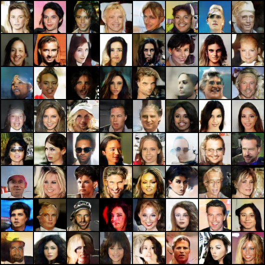

# GAN-Architectures

### Author
Shantam Bajpai 

### Architectures Implemented
1. DCGAN (Deep Convolutional Generative adversarial network)

2. WGAN (Wasserstein Generative Adversarial Network)

3. WGAN With Gradient Penalty

4. CGAN (Conditional Generative adversarial network)

### Research Paper References
DCGAN: https://arxiv.org/pdf/1511.06434.pdf

WGAN: https://arxiv.org/pdf/1701.07875.pdf

WGAN-GP: https://arxiv.org/pdf/1704.00028v3.pdf

### Dataset Used
The dataset used to train the Generative adversarial networks was the celeba dataset which is a large scale face attributes dataset with more than 200K Celebrity faces.

### Visualizations

All the visualizations pertaining to the generation of fake images and the Generator-Discriminator loss curves will be carried out in tensorboard.  

### Fake Images Generated using DCGAN !
 

### Loss curves for DCGAN

### Fake Images Generated using WGAN for 5 epochs !

### Loss Curves for WGAN

