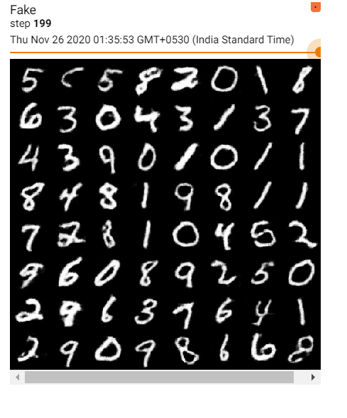

# GAN-Architectures

### Author
Shantam Bajpai 

### Architectures Implemented
1. DCGAN (Deep Convolutional Generative adversarial network)

2. WGAN (Wasserstein Generative Adversarial Network)

3. WGAN With Gradient Penalty

4. CGAN (Conditional Generative adversarial network)

5. EBGAN (Energy Based Generative Adversarial Network)

### Dataset Used
The dataset used to train the Generative adversarial networks was the celeba dataset which is a large scale face attributes dataset with more than 200K Celebrity faces and the MNIST Dataset (For conditional Wasserstein GAN-GP). 

## Tensorboard Visualizations

### Fake Images Generated using DCGAN 
 

### Loss curves for DCGAN

### Fake Images Generated using WGAN for 5 epochs 

### Loss Curves for WGAN (5 Epochs)

### Fake Images generated using WGAN-GP for 5 epochs 

### Loss Curves for WGAN-GP

### Fake Images generated using Conditional WGAN-GP after training for 20 Epochs

### Loss Curves for Conditional WGAN-GP 

### Research Paper References
DCGAN: https://arxiv.org/pdf/1511.06434.pdf

WGAN: https://arxiv.org/pdf/1701.07875.pdf

WGAN-GP: https://arxiv.org/pdf/1704.00028v3.pdf

CGAN: https://arxiv.org/pdf/1411.1784.pdf

EBGAN: https://arxiv.org/pdf/1609.03126.pdf
